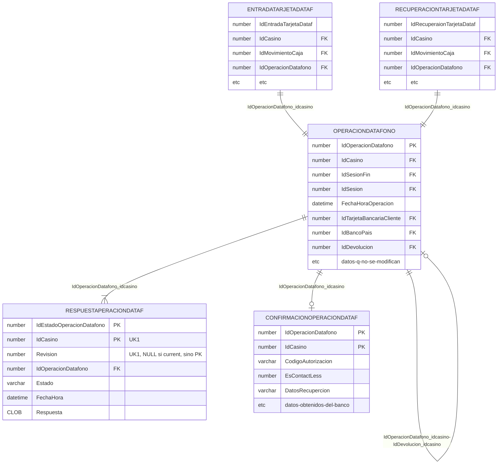

# test1

```mermaid

erDiagram
    OPERACIONDATAFONO ||--|{ RESPUESTAPERACIONDATAF : IdOperacionDatafono_idcasino
    OPERACIONDATAFONO ||--o| CONFIRMACIONOPERACIONDATAF : IdOperacionDatafono_idcasino
    OPERACIONDATAFONO ||--o| OPERACIONDATAFONO : IdOperacionDatafono_idcasino-IdDevolucion_idcasino
    ENTRADATARJETADATAF ||--|| OPERACIONDATAFONO : IdOperacionDatafono_idcasino
    RECUPERACIONTARJETADATAF ||--|| OPERACIONDATAFONO : IdOperacionDatafono_idcasino
    OPERACIONDATAFONO {
        number IdOperacionDatafono PK
        number IdCasino FK
        number IdSesionFin FK
        number IdSesion FK
        datetime FechaHoraOperacion
        number IdTarjetaBancariaCliente FK
        number IdBancoPais FK
        number IdDevolucion FK
        etc datos-q-no-se-modifican
    } 
    RESPUESTAPERACIONDATAF {
        number IdEstadoOperacionDatafono PK ""
        number IdCasino PK "UK1"
        number Revision "UK1, NULL si current, sino PK"
        number IdOperacionDatafono FK
        varchar Estado
        datetime FechaHora
        CLOB Respuesta
    }
    CONFIRMACIONOPERACIONDATAF {
        number IdOperacionDatafono PK
        number IdCasino PK
        varchar CodigoAutorizacion
        number EsContactLess
        varchar DatosRecupercion
        etc datos-obtenidos-del-banco
    }
    ENTRADATARJETADATAF {
        number IdEntradaTarjetaDataf
        number IdCasino FK
        number IdMovimientoCaja FK
        number IdOperacionDatafono FK
        etc etc
    }
    RECUPERACIONTARJETADATAF {
        number IdRecuperaionTarjetaDataf
        number IdCasino FK
        number IdMovimientoCaja FK
        number IdOperacionDatafono FK
        etc etc
    }
```

    
